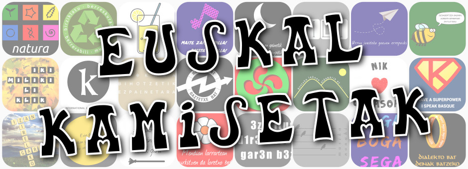

# Euskal kamiseten diseinu libreak
Biltegi ireki eta parte-hartzaile honetan, **euskaraz edo euskal kulturarekin lotutako kamiseten eta antzeko materialen diseinuak** aurki ditzakezu. Ekimen honen sortzailea Barakaldoko Sasiburu elkartea da, baina euskaldun orori zabalik dago eta ekarpenak jasotzeko prest.

Bilatzen ditugun gaiak eta estiloak:
- Diseinu modernoak, klasikoak, umoretsuak, apurtzaileak edota folklorikoak.
- Testuak, marrazkiak edota argazkiak dituztenak.
- Euskararekin edota euskal kulturarekin zerikusia dutenak.

Bilatzen ez duguna:
- Euskararekin edota euskal kulturarekin zerikusirik ez dutenak.
    - Biltegi honekin zerikusi zuzenik ez duen diseinurik baduzu, argitara ezazu beste nonbait, eskerrik asko.
- Pertsonen duintasunaren aurka egiten dutenak.
    - Arrazagatik, sexuagatik, erlijioagatik, iritziagatik, nazionalitatearengatik, minusbaliotasunagatik edo beste edozein egoera pertsonalagatik edo sozialagatik inor, batez ere haur eta gazteak, diskriminatzaileak bezala uler daitezkeen diseinuak ez ditugu onartuko. Adierazpen askatasuna eta kritikatzeko eskubideak zilegiak dira noski, eta horiek ere lekua dute biltegi honetan, baina Sasiburuko kideok ekarpenak baztertzeko eskubidea gordetzen dugu biltegi osoaren onerako izan daitekeela uler genezakeen kasuetan.

## Hartu, erabili eta zabaldu

Biltegi honetako eduki guztiak, bestelakorik adierazi ezean, Creative Commons fundazioaren **CC0 1.0** Unibertsala testu-legalak ezartzen duenaren arabera argitaratzen dira. Informazio gehiagorako irakurri CC0 1.0ren [laburpena](https://creativecommons.org/publicdomain/zero/1.0/deed.eu) eta [testu-legala](https://creativecommons.org/publicdomain/zero/1.0/legalcode.eu).

Hitz gutxitan, honek esan nahi du biltegi honetako fitxategi guztiak, bestelakorik adierazi ezean, legeak ahalbidetzen duen neurrian, 'jabari publikoan' lagatzen direla. Hau da, berauok kopiatzeko eta zabaltzeko askatasuna duzula, baita lan eratorriak sortu eta berauok nahi duzun eran zabaltzeko ere. Horretaz gain, biltegi honetako fitxategiak erabiltzean edo aipatzean, ez duzula egiletasunari buruzko aitortzarik egin beharrik.

## Parte hartzeko baldintzak

Zure ekarpenak egin nahi badituzu, aurrera mesedez. Biltegi hau diseinatzaile, marrazkilari eta ilustratzaile gehiagoren artean handitzeko irrakitan gaude!

Hori bai, ziurtatu zaitez bidaltzen diguzun fitxategi guztien egile eskubideak dituzula edo eskubideon jabeak biltegi honetan eta baldintza hauetan argitaratzea onartzen duela. Zalantzarik baduzu, logotipo, argazki edo dena delakoaren egileari galdetu eta, posible bada, erabilera honetarako onarpen idatzia eskatu. Edukiek arazorik ez badute, biltegi erabilgarriagoa osatuko dugu denon artean. Eskerrik asko!

Ezinbestekoa ez bada ere, eduki libre hauek sortzeko, programa eta aplikazio libreak erabiltzea gomendatzen dizugu (Adobe Photoshop-en eta Illustrator-ren ordez, GIMP, Inkscape eta antzekoak). Igotzen dituzun fitxategiak ere formatu irekietan egotea gomendatzen dizugu (PSD eta AI fitxategien ordez, XCF, SVG eta antzekoak). Eskerrik asko!

Horrela nahiko bazenu, software jabedunekin sortutako copyright-dun irudiak sor ditzakezu (info.txt fitxategian "Copyright" lizentzia adierazi), baina horrek zure ekarpenen zabalkundea mugatuko duela ohartarazten dizugu (zuri baimena eskatu eta zuk baiezkoa eman ezean, inork ez du zure diseinua erabiliko).

Ekarpenak egiteko, webgune honetan "Pull request" bat egin dezakezu edo fitxategiak epostaz bidal ditzakezu guk argitaratzeko: sasiburu@gmail.com

Biltegiko diseinuen parte-hartzaileen zerrenda:
- Txopi (Sasiburu)

## Kamisetak nahi ditut!

Diseinu hauekin kamisetak eta antzeko materialak sortzeko, zure gogoko serigrafia batera jotzea besterik ez duzu. Zure gogoko diseinua librea bada (adibidez CC0 1.0 lizentzia badu), librea zara moldatzeko edo dagoen bezala nahi beste kopia egiteko. Euskarazko diseinu hauek soinean eramanez, paisaia linguistikoa euskalduntzen lagunduko duzu. Eskerrik asko!   

Kamiseta bakarra nahi baduzu, agian [Sasiburuk prestatu duen DENDA](https://www.latostadora.com/sasiburu/) erabiltzea nahiago izango duzu. Hautazkoa da, baina erabiltzen baduzu, gogoan izan erosten duzun kamiseta bakoitzeko 1,5 €rekin lagunduko duzula Sasiburu elkartea. Eskerrak aurretiaz ematen dizkizugu erosketaren bat egiten baduzu.

Diseinu interesgarriren bat bururatu bazaizu, zuk zeuk sortu edo lagun bati sortzeko eskatu. Guri bidali nahi badiguzu biltegira beste diseinu libre bat gehi dezagun, asko eskertuko dizugu!

##### Beste denda batzuk

Gehiagoren gogoarekin geratu bazara, euskal diseinuak dituzten kamiseten eta antzeko materialen denda eta webgune hauek aurkitu ditugu:
- [GabRek](https://gabrek.eus/)
- [Tribal Basque](https://www.tribalbasque.com/) 
- [Argia](https://azoka.argia.eus/) aldizkariaren azoka
- [Onddo ta punto](http://www.onddotapunto.com/)
- [Bikoitz](http://camisetasbikoitz.com/shop/55-euskal-herria-y-bilbao)
- [Euskal Souvenirs](https://www.euskalsouvenirs.com/)
- [Pelotadenda](https://www.pelotadenda.com/eu_kamisetak.aspx)
- [KOT](https://www.kotnatura.com/)
- [LaTostadora](https://www.latostadora.com/camisetas/euskal+herria/) orokorra (ez Sasiburuko txokoa)